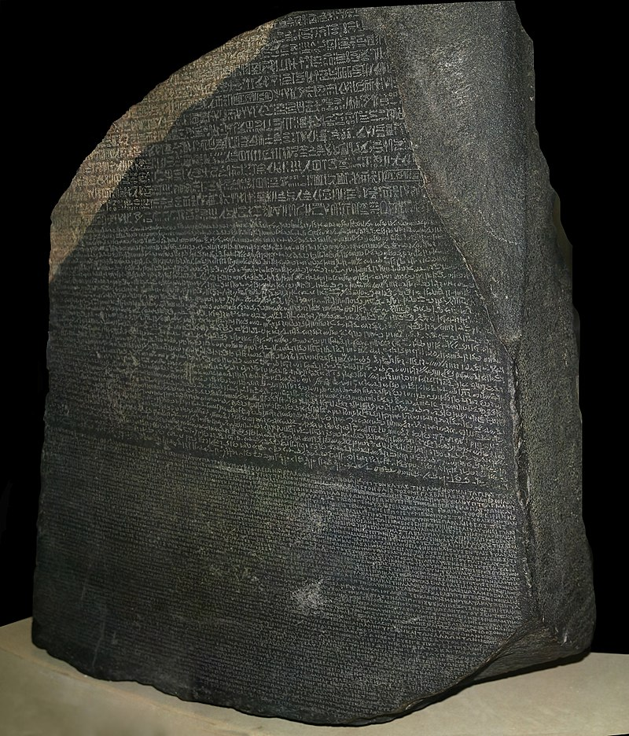

# **coordinate_systems**
This module was created to manage the change between coordinate systems.

  

It also can be useful as a Rosetta Stone (bridge) between different programming languages. Nowadays the stone is writen in the following languages:

- **Arduino**
- **C++ (Cpp)**
- **Java**
- **Octave (Matlab)**
- **Python**

 

 

The Rosetta Stone is a stele composed of granodiorite inscribed with three versions of a decree issued in Memphis, Egypt, in 196 BC during the Ptolemaic dynasty on behalf of King Ptolemy V Epiphanes. The top and middle texts are in Ancient Egyptian using hieroglyphic and Demotic scripts respectively, while the bottom is in Ancient Greek. The decree has only minor differences between the three versions, making the Rosetta Stone key to deciphering the Egyptian scripts. [[**1**]](./documents/5_list_references.md)

---
 

# **coordinate systems index**

The following index show the information/scripts inside the repository:

1. [**Coordinate systems - Information**](./documents/1_coordinate_systems_information.md): Link to 1_coordinate_systems_information. Description of the most commonly used coordinate systems.
2. [**Coordinate systems - Transformation**](./documents/2_coordinate_systems_transformation.md): Link to 2_coordinate_systems_transformation. Description of the most commonly used transformation between coordinate systems.
3. [**Script files/folders**](./documents/3_script_files_folders.md): Link to 2_script_files_folders. Description of the scripts inside the repository.
4. [**Documents of interest**](./documents/4_documents_of_interest.md): Link to 3_documents_of_interest. Some documents of interest.
5. [**Webs of interest**](./documents/5_link_to_webs_of_interest.md): Link to 4_link_to_webs_of_interest. Some links to webs of interest.
6. [**List of references**](./documents/6_list_references.md): List with all the references.
  

# Educational purpose

This github repository was created with 2 main goals:

- Helping all the people to understand the different coordinate systems (I include myself).

- To be a "Rosetta Stone" to understand different programming languages.
