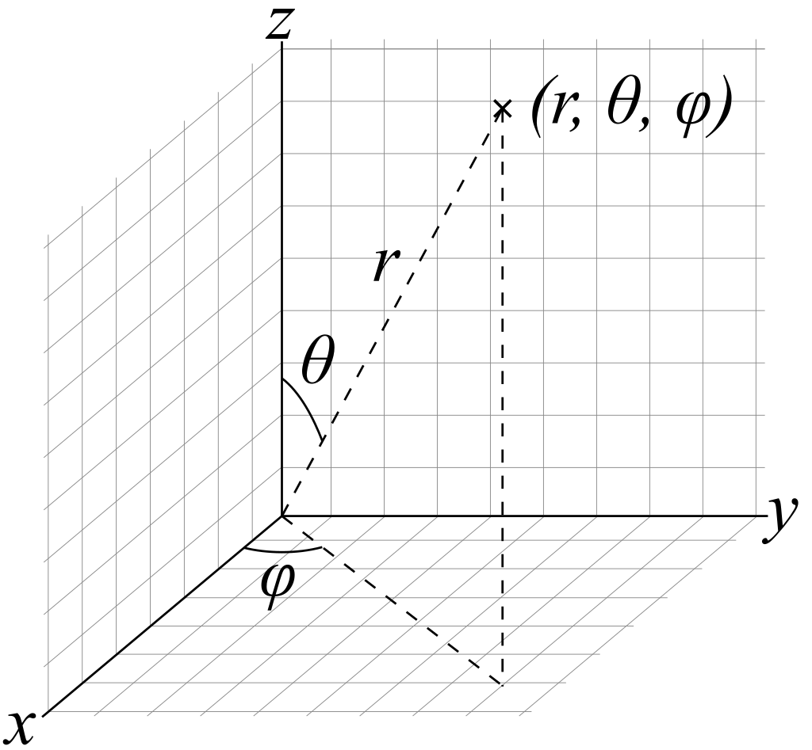

   

# **coordinate_systems**
This module was created to manage the change between coordinate systems

The main module nowadays is coordinate_systems.py

## **coordinate_systems.py**

The following index will show the information/scripts inside the repository:

1. [**Coordinate systems - Information**](./documents/1_coordinate_systems_information.md): Some information about coordinate systems.
2. [**Script files/folders**](./documents/2_script_files_folders.md): Description of the scripts inside the repository.