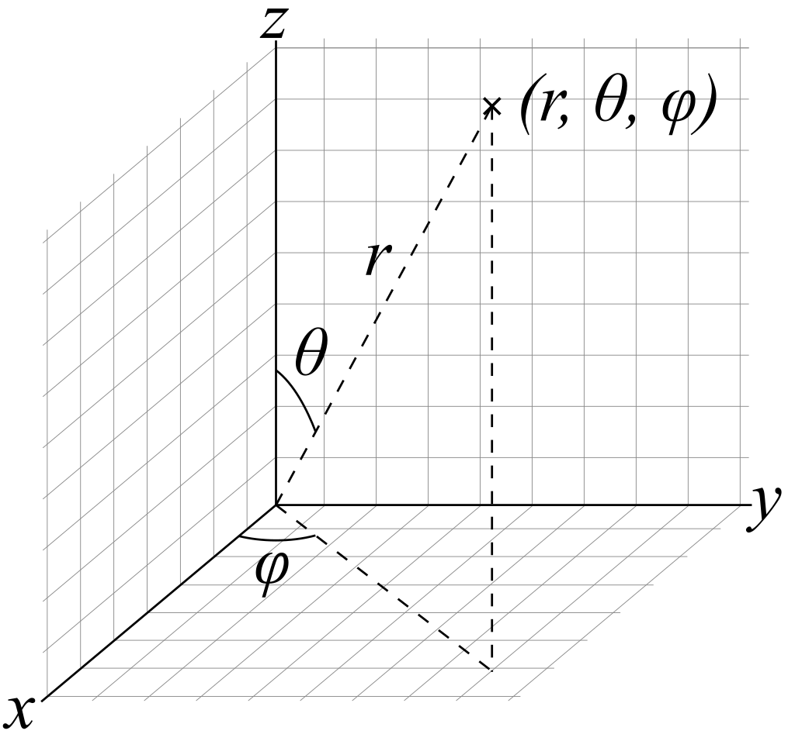

  

# **coordinate_systems**
This module was created to manage the change between coordinate systems

## **COORDINATE_SYSTEMS**

The following index will show the information/scripts inside the repository:

1. [**Coordinate systems - Information**](./documents/1_coordinate_systems_information.md): Some information about coordinate systems.
2. [**Script files/folders**](./documents/2_script_files_folders.md): Description of the scripts inside the repository.
3. [**Documents of interest**](./documents/3_documents_of_interest.md): Some documents of interest.
4. [**Webs of interest**](./documents/4_links_to_web_of_interest.md): Link to 4_links_to_web_of_interest. Some links to webs of interest.
5. [**List of references**](./documents/5_list_references.md): List with all the references.