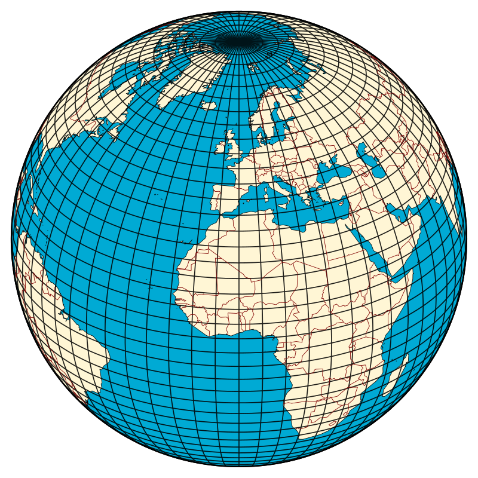
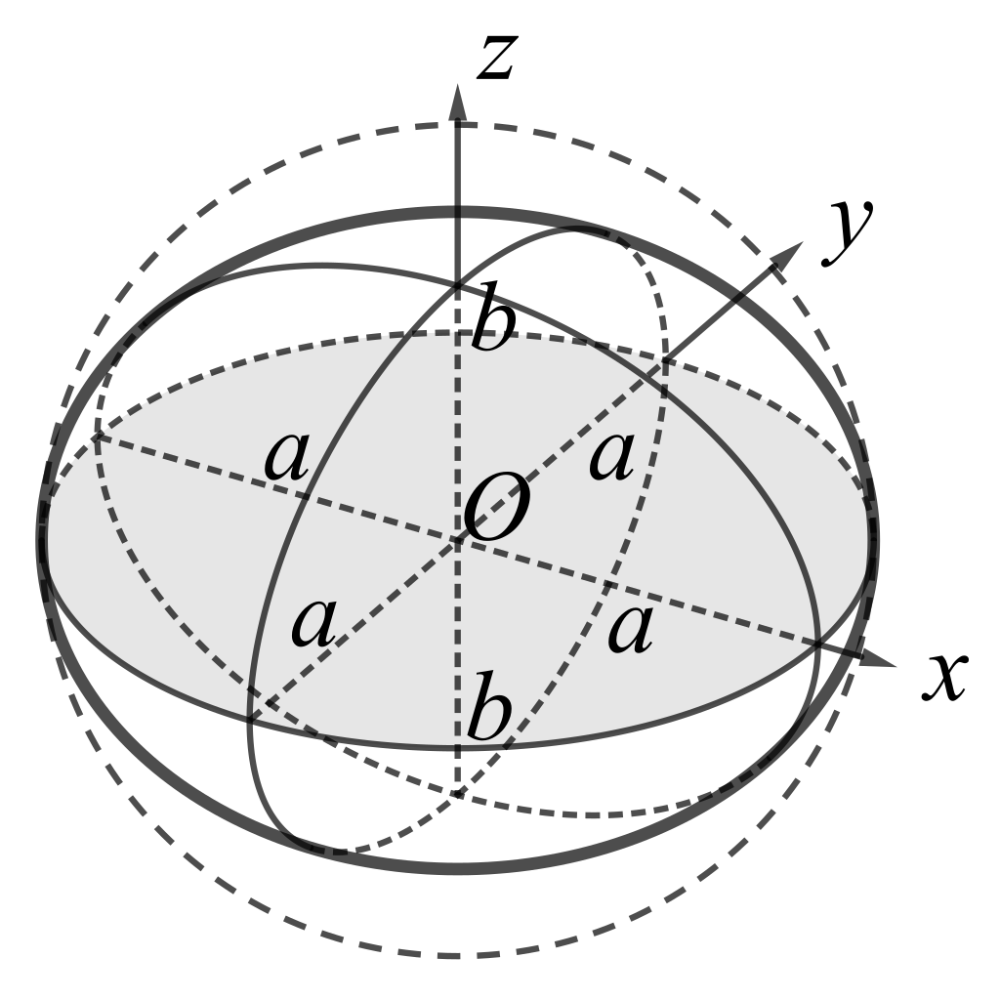
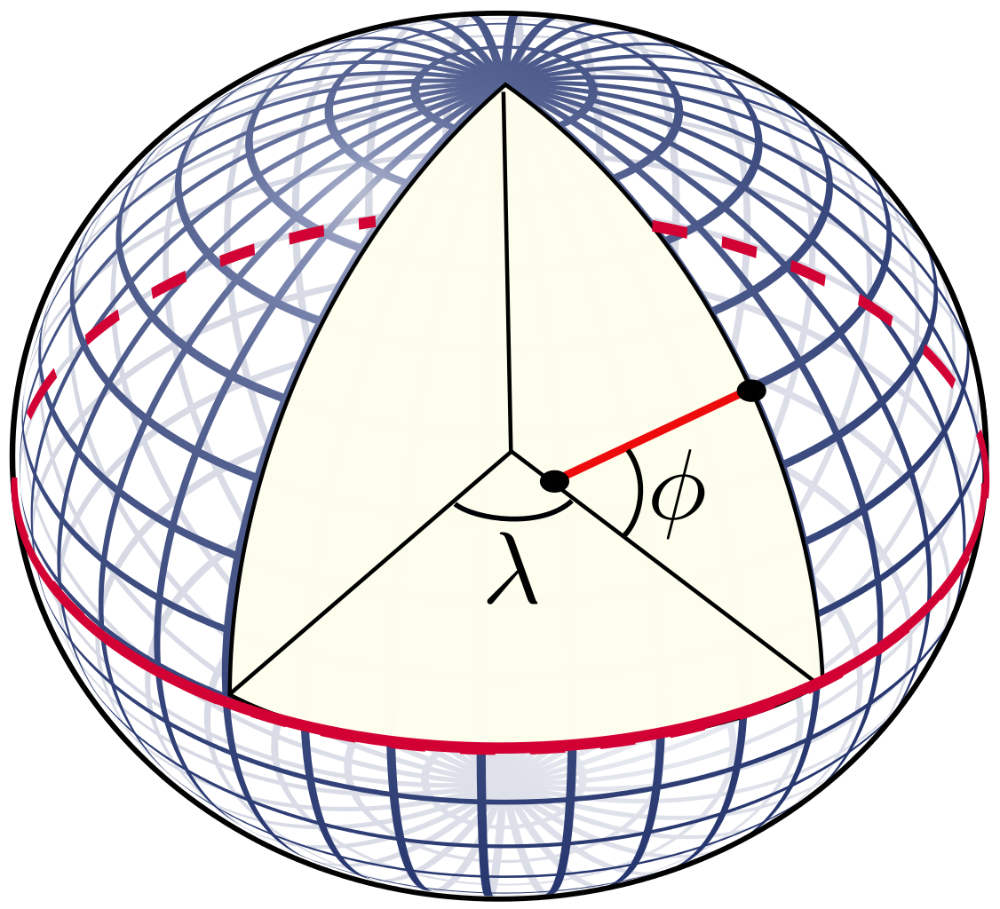
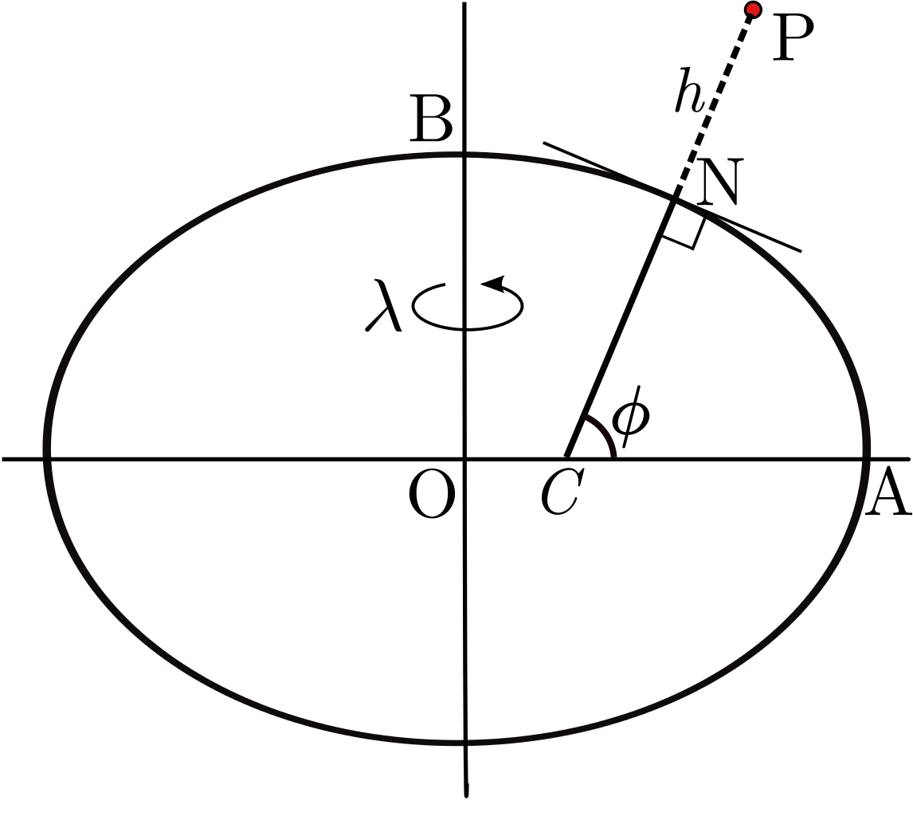
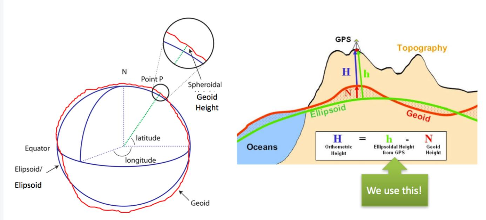
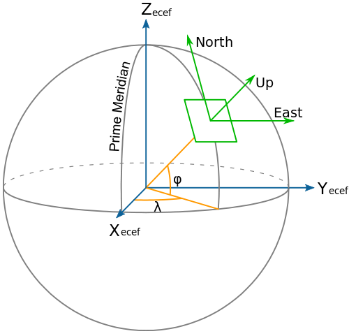
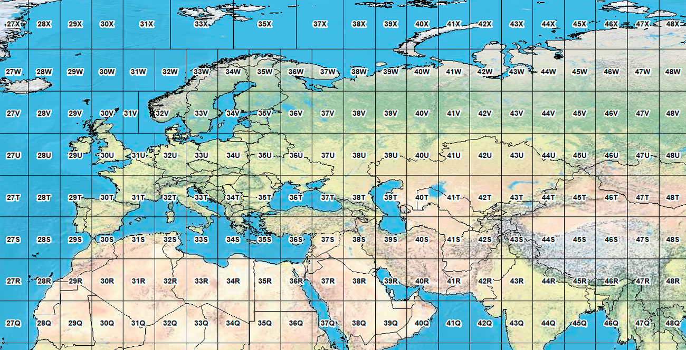
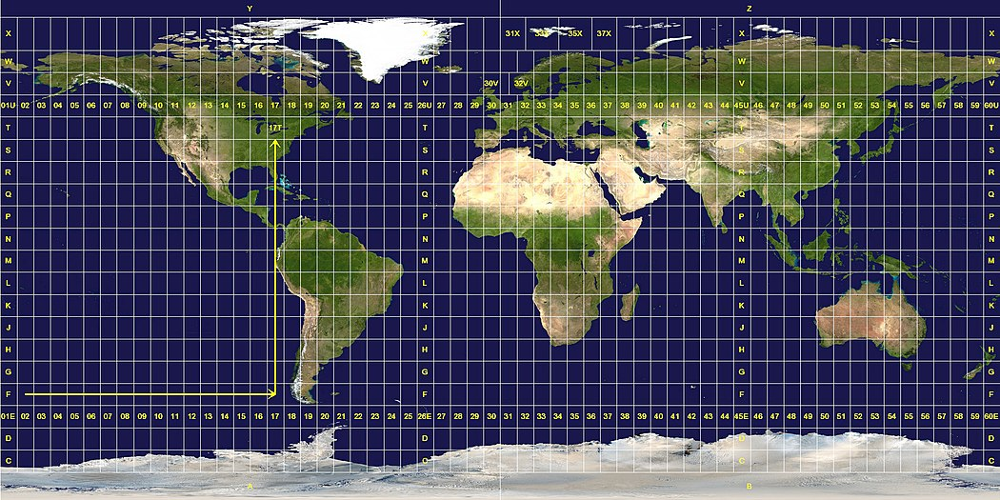

# **1 Coordinate systems information**

0. [**README link**](./../README.md): Link to main README file.
1. [**Coordinate systems - Information**](./1_coordinate_systems_information.md): Link to 1_coordinate_systems_information. Description of the scripts inside the repository.
2. [**Script files/folders**](./2_script_files_folders.md): Link to 2_script_files_folders. Description of the scripts inside the repository.
3. [**Documents of interest**](./3_documents_of_interest.md): Link to 3_documents_of_interest. Some documents of interest.
4. [**Webs of interest**](./4_links_to_web_of_interest.md): Link to 4_links_to_web_of_interest. Some links to webs of interest.
  

## **1.1 World Geodetic System: A geodetic datum or geodetic system**

    

 

A geodetic datum or geodetic system (also: geodetic reference datum, geodeticreference system, or geodetic reference frame) is a global datum reference orreference frame for precisely representing the position of locations on Earth orother planetary bodies by means of geodetic coordinates. Datums are crucial to anytechnology or technique based on spatial location, including geodesy, navigation,surveying, geographic information systems, remote sensing, and cartography. Ahorizontal datum is used to measure a location across the Earth's surface, inlatitude and longitude or another coordinate system; a vertical datum is used tomeasure the elevation or depth relative to a standard origin, such as mean sealevel (MSL). Since the rise of the global positioning system (GPS), the ellipsoidand datum WGS 84 it uses has supplanted most others in many applications. The WGS84 is intended for global use, unlike most earlier datums.
  

## **1.2 The geometry of the ellipsoid**

The shape of an ellipsoid of revolution is determined by the shape of the ellipse which is rotated about its minor (shorter) axis. Two parameters are required. One is invariably the equatorial radius, which is the semi-major axis, **a**. The other parameter is usually the *polar radius* or *semi-minor axis*, **b**; or the (first) *flattening*, **f**; or the (first) *eccentricity*, **e**. These parameters are not independent, they are related by:

- **f = (a-b)/a**

- **e^2 = (2-f)·f**

- **b = a·(1-f) = a·sqrt(1-e^2)**

    
    

  

The definition of geodetic **latitude (phi)** and **longitude (lambda)** on an ellipsoid. The normal to the surface does not pass through the centre, except at the equator and at the poles.
  

## **1.3 The Geodetic (Lat/Long) Coordinate System**

    

 
The "geodetic" coordinate system is known to most as the "Latitude and Longitude" coordinate system. The geodetic grid for the planet is comprised of parallel East/West lines of latitude and North/South lines of longitude that intersect at the poles. Latitude and longitude lines are labeled by the angle they subtend with respect to a reference. For latitude, that 0 reference is the Equator and for longitude that 0 reference is the Prime Meridian.

Since the longitude lines are not parallel, the horizontal distance for a degree of longitude depends on your location. Therefore, the geodetic location does not have intuitive understanding of distance that other coordinate systems have. However, the geodetic coordinate system is globally consistent and therefore is a good coordinate system for positioning high altitude and space-based platforms.

In geodetic coordinates the Earth's surface is approximated by an ellipsoid and locations near the surface are described in terms of latitude, longitude  and height. The ellipsoid is completely parameterised by the semi-major axis **a** and the flattening **f**.
  

### **1.3.1 WGS84 Elipsoidal model: World Geodetic System 1984**

The global positioning system (GPS) uses the world geodetic system 1984 (WGS84) to determine the location of a point near the surface of the Earth.

    

 

#### **1.3.1.1 WGS 84 defining parameters**

| Constant                  | Notation  | Value        |
|:--------------------------|:---------:|:------------:|
|Semi-minor axis            | a         |6378137.0 m   |
|Reciprocal of flattening   | 1/f       |298.257223563 |
 

 #### **1.3.1.2 WGS 84 derived geometric constants**

| Constant                   | Notation  | Value            | Aproximation      |
|:---------------------------|:----------|:----------------:|:-----------------:|
|Semi-minor axis             | b         |a·(1-f)           |6356752.3142 m     |
|First eccentricity squared  | e^2       |(2-f)·f           |6.69437999014·10^-3|
|Second eccentricity squared | e'^2      |f·(2-f)/(1-f)^2   |6.73949674228·10^-3|
|Third flattening            | e'^2      |(a-b)/(a+b)       |6.73949674228·10^-3|

## **1.4 Earth-Centered, Earth-Fixed (ECEF) Coordinate System**

    

 

The Earth-Centered, Earth-Fixed (ECEF) coordinate system is also known as the "conventional terrestrial" coordinate system. It is a simple Cartesian coordinate system with the center of the earth at it’s origin. The +X axis passes through the Equator and Prime Meridian intersection. The +Z axis passes through the North Pole. The +Y axis is orthogonal to +X and +Z. As a result, this coordinate system rotates with the earth. The distances used along each axis are meters.

Since the entire ECEF reference frame rotates with the earth, this coordinate system is useful for positioning geo-stationary objects such as satellites. In fact, the Global Positioning System (GPS) uses ECEF as it’s primary coordinate system and derives all other coordinates from it. However, since ECEF has an origin that is very far from most locations on the surface of the earth, it would be awkward for a small scene with a platform located at a small distance away because all the coordinates will be biased by the large offset to the center of the earth.

## **1.5 The Scene East-North-Up (Scene ENU) coordinate system**

    

 

The "scene" or "local" coordinate system is the most basic coordinate system. The "scene" coordinate system is essentially an arbitrary, Cartesian coordinate system. By definition, the coordinate system is a "flat earth" system that uses linear X, Y and Z coordinates to locate elements with respect to the coordinate systems origin. This coordinate system is best used for smaller area extents where the curvature of the earth is not a concern (less than 4 km).

Although the coordinate system is itself arbitrary, the "scene" coordinate system still supports geolocation because the origin of this arbitrary coordinate system is tied to a geolocation. When translated to this geolocated "tie point", the scene +Y axis corresponds to North and the scene +X corresponds to East. This makes the scene coordinate system an "East North Up" (ENU) coordinate system.

Because the scene coordinate system assumes a flat earth, it is not a good coordinate system to use over large distances. For example, unless your platform is directly overhead, using the scene coordinate system for a high altitude or space-based platform would not be suggested. However, it is a convenient coordinate system for small areas because it allows for the use of Euclidean geometry.

## **1.6 The Universal Transverse Mercator (UTM) Coordinate System**

    

 

    

 

The Universal Transverse Mercator (UTM) coordinate system is a geographic coordinate system which utilizes a conformal projection that preserves angles locally. This is achieved by breaking the entire globe into a sequence of small conformal projections. These local projections are called "grid zones" which are defined by a longitude "zone" (the earth is divided into 60 zones, each 6 degrees wide and number sequentially) and a latitude "band" (the earth is divided into 20 latitude bands, each 8 degrees wide and labeled with a lettering scheme). The horizontal location offsets within a given grid zone are referred to as the "Easting" and "Northing" and are generally measured in meters.

The key advantage of the UTM coordinate system is that distances and angles can be computed using Euclidean geometry over short distances. This makes is very easy to compute distances and angles. And coordinate units are in meters, making the coordinates intuitive to interpret. However, the UTM projections suffer from ambiguities at the meeting of two grids zones and general distortions for large areas and distances. Although UTM could be used to position a plane or satellite, as it moved from one grid zone to another, the relative position will be prone to errors.