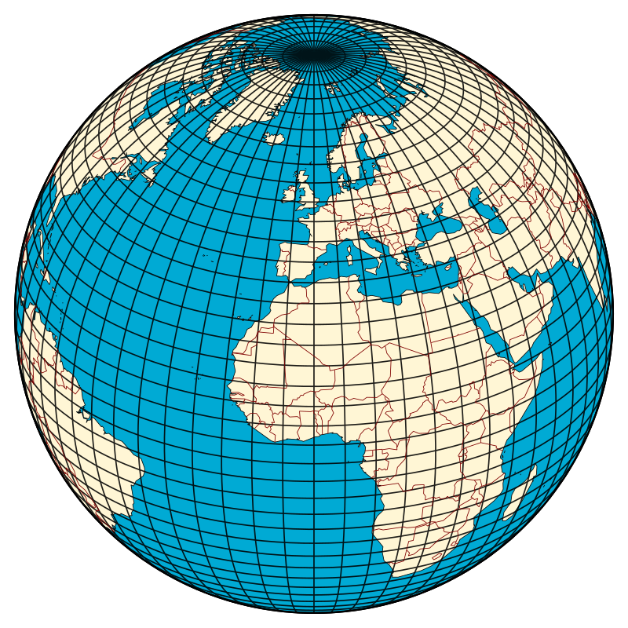
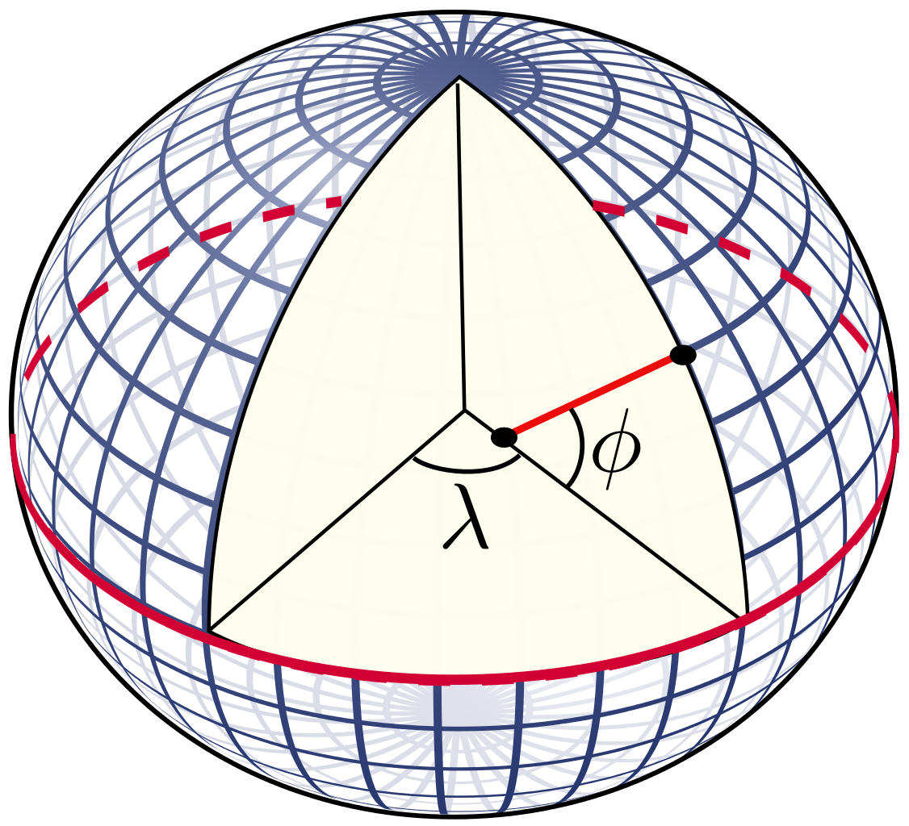
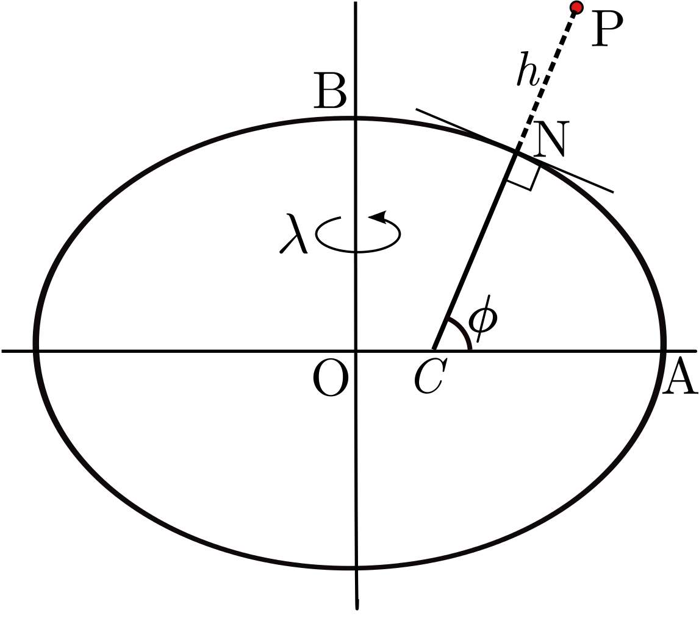
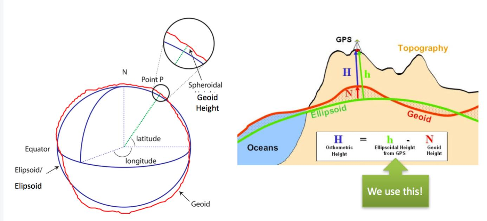

# **1 Coordinate systems information**

- [**README link**](./../README.md): Link to main README file.
- [**Script files/folders**](./2_script_files_folders.md): Link to 2_script_files_folders. Description of the scripts inside the repository.
  

## **1.1 World Geodetic System: A geodetic datum or geodetic system**
- Web0: http://wiki.gis.com/wiki/index.php/Geodetic_system
- Web1: https://en.wikipedia.org/wiki/Geodetic_datum
- Web2: http://www.jpz.se/Html_filer/wgs_84.html
- Web3: https://en.wikipedia.org/wiki/Latitude#Ellipsoidal-harmonic_coordinates
- Web4: https://programmerclick.com/article/8091830266/

    

 

A geodetic datum or geodetic system (also: geodetic reference datum, geodeticreference system, or geodetic reference frame) is a global datum reference orreference frame for precisely representing the position of locations on Earth orother planetary bodies by means of geodetic coordinates. Datums are crucial to anytechnology or technique based on spatial location, including geodesy, navigation,surveying, geographic information systems, remote sensing, and cartography. Ahorizontal datum is used to measure a location across the Earth's surface, inlatitude and longitude or another coordinate system; a vertical datum is used tomeasure the elevation or depth relative to a standard origin, such as mean sealevel (MSL). Since the rise of the global positioning system (GPS), the ellipsoidand datum WGS 84 it uses has supplanted most others in many applications. The WGS84 is intended for global use, unlike most earlier datums.
  

## **1.2 The geometry of the ellipsoid**

The shape of an ellipsoid of revolution is determined by the shape of the ellipse which is rotated about its minor (shorter) axis. Two parameters are required. One is invariably the equatorial radius, which is the semi-major axis, **a**. The other parameter is usually the *polar radius* or *semi-minor axis*, **b**; or the (first) *flattening*, **f**; or the (first) *eccentricity*, **e**. These parameters are not independent, they are related by:

- **f = (a-b)/a**

- **e^2 = (2-f)·f**

- **b = a·(1-f) = a·sqrt(1-e^2)**

    
    

  

The definition of geodetic **latitude (phi)** and **longitude (lambda)** on an ellipsoid. The normal to the surface does not pass through the centre, except at the equator and at the poles.
  

## **1.3 Geodetic coordinates**

    

 

In geodetic coordinates the Earth's surface is approximated by an ellipsoid and locations near the surface are described in terms of latitude, longitude  and height. The ellipsoid is completely parameterised by the semi-major axis **a** and the flattening **f**.
  

## **1.4 WGS84 Elipsoidal model: World Geodetic System 1984**

The global positioning system (GPS) uses the world geodetic system 1984 (WGS84) to determine the location of a point near the surface of the Earth.

    

 

### **1.4.1 WGS 84 defining parameters**

| Constant                   | Notation  | Value        |
|:---------------------------|:---------:|:------------:|
|Semi-minor axis             | a         |6378137.0 m   |
|First eccentricity squared  | 1/f       |298.257223563 |
 

 ### **1.4.2 WGS 84 derived geometric constants**

| Constant                   | Notation  | Value            | Aproximation      |
|:---------------------------|:----------|:----------------:|:-----------------:|
|Semi-minor axis             | b         |a·(1-f)           |6356752.3142 m     |
|First eccentricity squared  | e^2       |(2-f)·f           |6.69437999014·10^-3|
|Second eccentricity squared | e'^2      |f·(2-f)/(1-f)^2   |6.73949674228·10^-3|