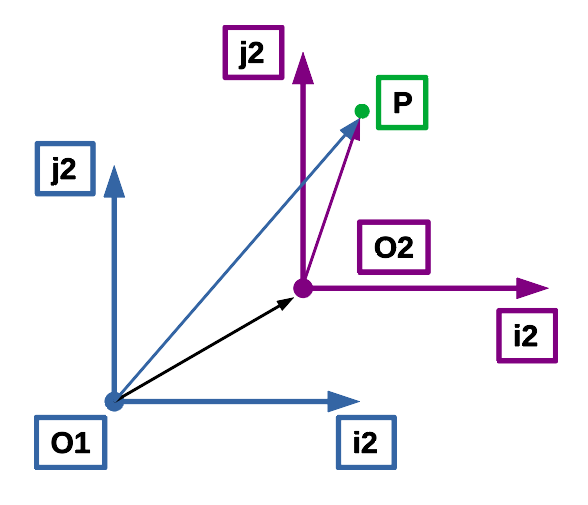
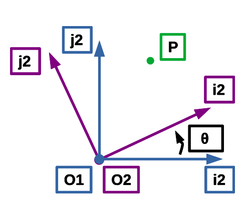

0. [**README link**](./../README.md): Link to main README file.
1. [**Coordinate systems - Information**](./1_coordinate_systems_information.md): Link to 1_coordinate_systems_information. Description of the most commonly used coordinate systems.
2. [**Coordinate systems - Transformation**](./2_coordinate_systems_transformation.md): Link to 2_coordinate_systems_transformation. Description of the most commonly used transformation between coordinate systems.
3. [**Script files/folders**](./3_script_files_folders.md): Link to 2_script_files_folders. Description of the scripts inside the repository.
4. [**Documents of interest**](./4_documents_of_interest.md): Link to 3_documents_of_interest. Some documents of interest.
5. [**Webs of interest**](./5_link_to_webs_of_interest.md): Link to 4_link_to_webs_of_interest. Some links to webs of interest.
6. [**List of references**](./6_list_references.md): List with all the references.
<br/><br/>

# **2 Coordinate systems - Transformation**

## **2.1 Universal conversion between 2 orthogonal reference frames**

Let's say that the ECEF coordinate system is the coordinates system 1. The Body coordinate system will be the coordinate system 2.

The conversion between 2 orthogonal reference frames could be decomposed in 2 transformations:

### **2.1.1 Translation of the coordinate system origin**

<br/>
<p align="center">
    
</p>
<br/>

The coordinates of an arbitrary point (P) in the coordinate system 1 (O1) can be expressed as a combination of a vector joining both reference systems origins and the coordinates in the reference system 2 (O2):

- **O1_P = O1_O2 + O2_P**

Were:

- **O1_P** is the vector from the origin of the reference frame 1 to the point P.

- **O1_O2** is the vector from the origin of the reference frame 1 to the point the origin of the reference frame 2.

- **O1_P** is the vector from the origin of the reference frame 2 to the point P.

As algebra declare, for any of this combinations:

**O1_O2 = -O1_O2**

So we can also say:

- **O2_P = O2_O1 + O1_P**

This is very useful to get other kind of transformations.

<br/>

### **2.1.2 Rotation of the coordinate system into final orientation**

<br/>
<p align="center">
    
</p>
<br/>

The coordinates of an arbitrary point (P) in the coordinate system 1 (O1) can be expressed as the multiplication of a rotation matrix (R[θ]) by a coordinates vector in the reference system 2 (O2):

- **O1_P = R[θ] * O2_P**

R[θ] can be expressed with the following formulation:

```
                         [ i2x1 j2x1 k2x1 ]
R[θ] = [ i21 j21 k21 ] = [ i2y1 j2y1 k2y1 ]
                         [ i2z1 j2z1 k2z1 ]
```
Were i, j and k are the unitary vector for x, y and z axis.

- i21 represent the x axis unitary vector of the coordinate system 2. Reference coordinate system 1.
- i2x1 represent the x component of x axis unitary vector of the coordinate system 2. Reference coordinate system 1. 

As rotation matrix are orthogonal we can say:

inverse(R[θ]) = transpose(R[θ])

```
                [ i21 ]    [ i2x1 i2y1 i2z1 ]
inverse(R[θ]) = [ j21 ] =  [ j2x1 j2y1 j2z1 ]
                [ k21 ]    [ k2x1 k2y1 k2z1 ]
```

### **2.1.3 Rotation and translation of the coordinate system into final orientation**

Taking the equations from both, translation and rotation, we can get the equation to get the ECEF coordinates from Body as combination of both transformations:  

- **Oi_P = R[θ] * O2_P**

- **O1_P = O1_Oi + Oi_P**

- **O1_P = O1_Oi + R[θ] * O2_P**

The inverse equation to get the coordinates in body reference frame would be:

- **O1_P = O1_Oi + R[θ] * O2_P**

- **O1_P-O1_Oi = R[θ] * O2_P**

- **O2_P = inverse(R[θ]) * (O1_P-O1_Oi)**